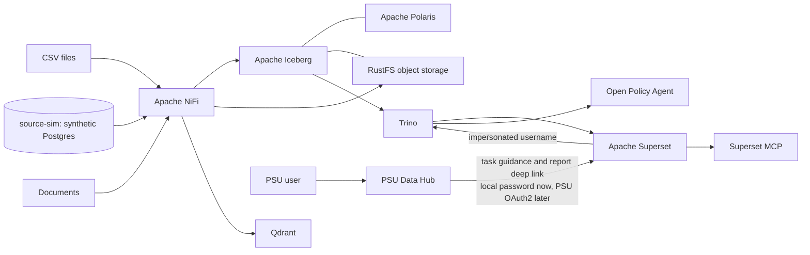

# PSU Lakehouse Architecture

## Runtime path

## Boundaries

- Iceberg is the durable structured-data contract.
- Polaris owns catalog metadata and uses PostgreSQL persistence.
- RustFS stores Iceberg data/metadata files and original documents locally.
- Trino is the supported SQL route; OPA authorizes its operations.
- Superset is the business dashboard, SQL Lab and AI/MCP layer.
- PSU Data Hub is a thin, Thai-first guidance layer. It does not authenticate a
  user or grant data access; it keeps ordinary users out of operator consoles
  and sends them to the appropriate authenticated Superset route.
- Trino authenticates clients with a local password file over TLS. It used to
  accept whatever username a client asserted, which is why the stack could
  not be pointed at real data; the username is now proven, not claimed.
  Authorization is still OPA, and PSU SSO replaces the password file rather
  than extending it.
- Superset owns three shared development personas today. NiFi has a separate
  single-user login. Trino identities authenticate with a local password file
  over TLS and are then resolved to groups; the username is proven rather than
  claimed. PSU OAuth2 SSO is still deliberately not part of this phase.
- NiFi is the visual ingestion workbench. It replaces Airbyte in this Compose
  deployment because current Airbyte Core is deployed through Kubernetes and
  `abctl`, not a supported Docker Compose topology.
- NiFi never writes to Iceberg directly — its native Iceberg processors don't
  work against this stack's Polaris (verified: `RESTIcebergCatalog`/
  `PutIcebergRecord` fail regardless of config, see §6.4 of the README).
  Ingestion instead stages files in RustFS and drives Trino SQL
  (`hive.raw_staging`, a second file-metastore Trino catalog,
  [`config/trino/catalog/hive.properties`](../config/trino/catalog/hive.properties))
  to bridge into `polaris.raw`.
- Which database hosts may be used as an ingestion source at all is a
  committed, reviewable list (`config/guardrail/`), enforced by a `source-guard`
  service that `nifi` depends on. Production systems holding real personal data
  are on a denylist that wins over the allowlist, so reaching one would take two
  visible edits plus a change to this stack's missing controls. See
  [`SOURCE_GUARDRAIL_TH.md`](SOURCE_GUARDRAIL_TH.md).
- What gets ingested is decided by the `platform` database (schema `ingest`),
  not by the NiFi canvas: approved sources, the tables to load, the mirrored
  column classification, incremental watermarks, and one run record per
  attempt. The pipeline connects to it as `platform_app`, which can record
  runs but cannot register a source or enable a table for itself.
- The ingestion source used for development is `source-sim`, a synthetic
  Postgres whose rows are all generated (`config/source-sim/`). It carries its
  own column classification registry so the pipeline's PDPA filtering is
  exercised against realistic metadata rather than a real system.
- Table maintenance runs as its own Trino identity (`psu_maintenance`), which
  can compact, expire snapshots and delete orphaned files but cannot read a
  column of the data it maintains. That separation matters here because
  dropping an Iceberg table does not delete its files: orphan removal is what
  completes a deletion request, so the identity that performs it is the one
  with the most destructive reach in the stack.
- The control plane is exposed back through Trino as a read-only `platform`
  catalog, so the operations dashboard reads run history through the same
  engine and the same policy as every other query rather than through a second
  connection to PostgreSQL that OPA would never see.
- Qdrant is a rebuildable vector index, never the only copy of document text.

## Access-control flow

1. The test user authenticates with Superset's built-in username/password login.
2. Seeded users map to Superset Admin, Alpha or Gamma roles.
3. The seeded Trino database connection has user impersonation enabled, so
   queries carry the logged-in Superset username.
4. Trino resolves that username to local PSU groups and asks OPA whether the
   requested operation and table are permitted.
5. OPA defaults to deny. Analysts can read and write (`INSERT`/`UPDATE`/`DELETE`,
   no DDL) on `curated` and `published`; viewers can only select from `published`.
6. For a `SELECT`, Trino separately asks OPA for row filters
   (`opa.policy.row-filters-uri`). Non-executive viewers (any account whose
   `PSU_VIEWER_<n>_ORG_UNIT` is not `*`) get an `org_unit = '<their unit>'`
   predicate injected on any table listed in
   [`config/opa/org_scoped_tables.json`](../config/opa/org_scoped_tables.json) —
   an explicit per-table opt-in so a table without an `org_unit` column is
   never accidentally filtered (which would just fail the query). Executive
   viewers (`_ORG_UNIT=*`) and admin/analyst get no row filter.

The group renderer and OPA policy are intentionally visible policy-as-code; the
generated group file itself is ignored runtime state. Production should use
verified PSU OAuth2 group claims and TLS between every identity-aware service.

Row filtering is a Trino/OPA mechanism, not a Superset one — it applies to
every client that queries through Trino (Superset, `trino` CLI, JDBC, etc.),
so a single Superset dashboard built once shows each viewer only their own
org unit's rows with no per-dashboard configuration.

## Persistence

Every stateful service writes into `runtime/`:

| Folder | State |
|---|---|
| `runtime/postgres` | Polaris and Superset metadata databases |
| `runtime/rustfs` | Iceberg data/metadata files and source objects |
| `runtime/trino` | Trino local runtime state |
| `runtime/superset` | Superset home/configuration state |
| `runtime/qdrant` | Vector collections |
| `runtime/redis` | Superset cache |
| `runtime/nifi` | NiFi repositories, state, and logs; the flow definition is not yet guaranteed by these mounts |

This is a single-host MVP, not a highly available production deployment.
