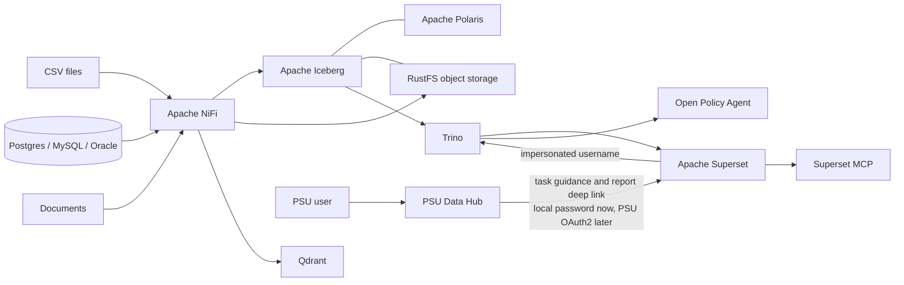

# PSU Lakehouse Architecture

## Runtime path

## Boundaries

- Iceberg is the durable structured-data contract.
- Polaris owns catalog metadata and uses PostgreSQL persistence.
- RustFS stores Iceberg data/metadata files and original documents locally.
- Trino is the supported SQL route; OPA authorizes its operations.
- Superset is the business dashboard, SQL Lab and AI/MCP layer.
- PSU Data Hub is a thin, Thai-first guidance layer. It does not authenticate a
  user or grant data access; it keeps ordinary users out of operator consoles
  and sends them to the appropriate authenticated Superset route.
- Superset owns three shared development personas today. NiFi has a separate
  single-user login. Trino usernames are asserted authorization labels, not
  authenticated accounts. PSU OAuth2 SSO is deliberately not part of this
  development phase.
- NiFi is the visual ingestion workbench. It replaces Airbyte in this Compose
  deployment because current Airbyte Core is deployed through Kubernetes and
  `abctl`, not a supported Docker Compose topology.
- Qdrant is a rebuildable vector index, never the only copy of document text.

## Access-control flow

1. The test user authenticates with Superset's built-in username/password login.
2. Seeded users map to Superset Admin, Alpha or Gamma roles.
3. The seeded Trino database connection has user impersonation enabled, so
   queries carry the logged-in Superset username.
4. Trino resolves that username to local PSU groups and asks OPA whether the
   requested operation and table are permitted.
5. OPA defaults to deny. Analysts can select only from `curated` and `published`;
   viewers can select only from `published`.

The group renderer and OPA policy are intentionally visible policy-as-code; the
generated group file itself is ignored runtime state. Production should use
verified PSU OAuth2 group claims and TLS between every identity-aware service.

## Persistence

Every stateful service writes into `runtime/`:

| Folder | State |
|---|---|
| `runtime/postgres` | Polaris and Superset metadata databases |
| `runtime/rustfs` | Iceberg data/metadata files and source objects |
| `runtime/trino` | Trino local runtime state |
| `runtime/superset` | Superset home/configuration state |
| `runtime/qdrant` | Vector collections |
| `runtime/redis` | Superset cache |
| `runtime/nifi` | NiFi repositories, state, and logs; the flow definition is not yet guaranteed by these mounts |

This is a single-host MVP, not a highly available production deployment.
